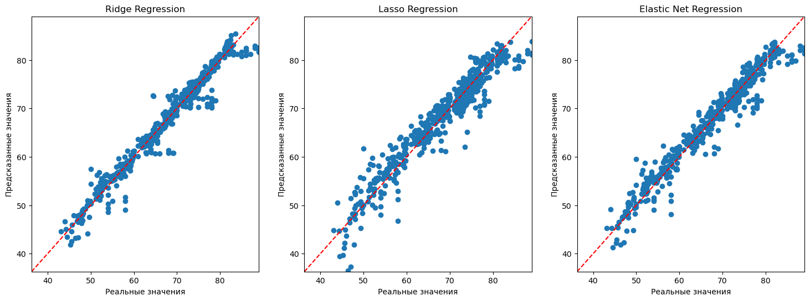

# Проект по анализу данных о продолжительности жизни

## Описание проекта
Проект посвящён анализу данных о продолжительности жизни, собранных из различных источников. Основная цель - выявить факторы, влияющие на продолжительность жизни, и визуализировать результаты анализа. Мы будем использовать методы статистики и машинного обучения для получения инсайтов из данных

## Поставновка задачи и достигнутые результаты
В ходе выполнения работы была построена модель линейной регрессии, направленная на выявление взаимосвязей между различными факторами (такими как доход, уровень образования, доступ к медицинским услугам и др.) и продолжительностью жизни

Результаты:
- Построена модель с подобранными для неё гиперпараметрами
- Выявлены ключевые факторы, влияющие на продолжительность жизни
- Построены модели предсказания продолжительности жизни на основе различных переменных

График для итогового предсказания

Описание параметров модели

1) ***Регрессия Риджа (Ridge Regression)***  
- *alpha*:  
    - Описание: Параметр регуляризации, который контролирует величину штрафа за сложность модели. Чем больше значение alpha, тем сильнее регуляризация  
    - Влияние: Высокие значения alpha могут привести к более простым моделям (с меньшими коэффициентами), что помогает предотвратить переобучение, но может также снизить точность на обучающих данных. Низкие значения могут привести к переобучению         
- *max_iter*:  
    - Описание: Максимальное количество итераций для алгоритма оптимизации  
    - Влияние: Увеличение этого параметра может помочь, если модель не сходится. Обычно достаточно 1000 итераций для большинства задач  
- *solver*:  
    - Описание: Алгоритм, используемый для оптимизации. В данном случае используется 'auto', что позволяет библиотеке scikit-learn автоматически выбирать наиболее подходящий алгоритм в зависимости от данных  
    - Влияние: Разные алгоритмы могут иметь разные скорости сходимости и требования к памяти  

2) ***Лассо Регрессия (Lasso Regression)***  
- *alpha*:  
    - Описание: Как и в регрессии Риджа, это параметр регуляризации, который контролирует величину штрафа за сложность модели  
    - Влияние: Лассо использует L1-регуляризацию, которая может приводить к обнулению некоторых коэффициентов, тем самым выполняя отбор признаков. Это делает модель более интерпретируемой и помогает избежать переобучения  
- *max_iter*:  
    - Описание: Максимальное количество итераций для алгоритма оптимизации  
    - Влияние: Увеличение этого параметра может помочь в случае медленной сходимости модели   
- *selection*:   
    - Описание: Метод выбора координат для обновления в процессе оптимизации. Может принимать значения 'cyclic' (циклический) или 'random'   
    - Влияние: 'cyclic' обновляет координаты по порядку, тогда как 'random' выбирает координаты случайным образом. Это может влиять на скорость сходимости и стабильность решения  

3) ***Регрессия Elastic Net***  
- *alpha*:  
    - Описание: Параметр регуляризации, аналогичный тому, что используется в Ridge и Lasso  
    - Влияние: Elastic Net сочетает L1 и L2-регуляризацию. Значение alpha контролирует общий уровень регуляризации  
- *l1_ratio*:  
    - Описание: Соотношение между L1 и L2-регуляризацией. Значение l1_ratio=1 соответствует Лассо (только L1), а l1_ratio=0 соответствует Риджу (только L2)  
    - Влияние: Это позволяет вам настраивать баланс между отбором признаков (L1) и сглаживанием (L2). Значения между 0 и 1 позволяют комбинировать оба подхода  
- *max_iter*:  
    - Описание: Максимальное количество итераций для алгоритма оптимизации  
    - Влияние: Как и в других моделях, увеличение этого параметра может помочь в случае медленной сходимости  
- *selection*:  
    - Описание: Метод выбора координат для обновления в процессе оптимизации, аналогично параметру в Лассо   
    - Влияние: Может влиять на скорость сходимости и стабильность решения  

## Использованные библиотеки
Проект использует следующие библиотеки:

- pandas: для обработки и анализа данных.
- numpy: для работы с массивами и математическими операциями.
- matplotlib: для 2D визуализации.
- seaborn: для создания информативных графиков.
- scikit-learn: для построения моделей машинного обучения.

## Структура репозитория
- **linear_regression.ipynb**: Jupyter Notebook с кодом, реализующим визуализацию градиентного спуска.
- **requirements.txt**: Файл со списком зависимостей, необходимых для запуска кода.

## Как использовать проект
1. Склонируйте репозиторий на свой компьютер.
2. Установите необходимые зависимости, указанные в файле `requirements.txt`.
3. Запустите Jupyter notebook `linear_regression.ipynb`, следуя инструкции в нём.

## Контактная информация
Если у вас есть вопросы или предложения по улучшению проекта, свяжитесь со мной:
- Email: maximgoltsov@gmail.com
